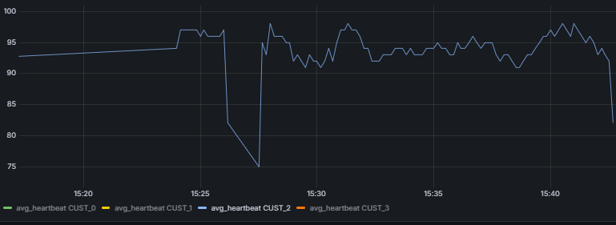
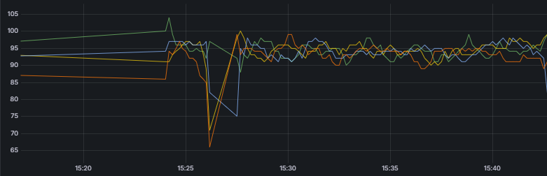

# Real-Time Data Processing Pipeline
This project aims to simulate and process real-time heart rate data for customers using a data
pipeline. You'll learn how to generate synthetic data, stream it using Apache Kafka, and store it
in a PostgreSQL database. This hands-on project introduces you to important concepts like datsimulation, message queuing, real-time processing, and database integration—core
components of modern data engineering systems.


This project sets up a real-time data processing pipeline using Kafka, Spark, PostgreSQL, and Grafana. The pipeline simulates heart rate data from four users, sends the data to Kafka, and then processes it with Spark. The processed results are stored in PostgreSQL and visualized using Grafana.

## 1. Environment Setup

### 1.1. Create `.env` File

To configure environment variables for your services, create a `.env` file in your project directory and populate it with the appropriate values from the `.env.example` file. This will configure your local environment for connecting to the various services like Kafka, Spark, and PostgreSQL.


---

## 2. Services Overview

The project uses several services orchestrated with Docker Compose. These services include Kafka, Spark (both master and worker), PostgreSQL, and Grafana.

- **Kafka**: Acts as the message broker.
- **Spark**: Consumes data from Kafka and processes it.
- **PostgreSQL**: Stores the processed data from Spark.
- **Grafana**: Provides data visualization.

### 2.1. Docker Compose Setup

Run Docker Compose Start the services defined in the docker-compose.yml:

```
docker compose up -d
```

---

## 3. Data Generator

### 3.1. `data_generator.py`

The `data_generator.py` file simulates heartbeat data for four users. The data is generated and sent to Kafka as a producer on your localhost.

To run the data generator:

1. Navigate to the `script/python` directory.
2. Execute the script:

```bash
cd script/python
python data_generator.py
```

This will generate dummy heartbeat data for four users and push it to Kafka.

---

## 4. Running Spark Streaming

Spark consumes the data from Kafka, processes it, and stores the results in PostgreSQL.

To run the Spark application:

1. Execute into the Spark container:

```bash
docker exec -it real-time-spark-master bash
```

2. Navigate to the Spark application directory:

```bash
cd /opt/spark/apps
```

3. Submit the Spark job:

```bash
spark-submit --packages org.apache.spark:spark-sql-kafka-0-10_2.12:3.5.5 --jars /opt/spark/resources/postgresql-42.7.2.jar stream_to_postgres.py
```

This will start the Spark streaming job, which reads data from Kafka, processes it, and writes it to PostgreSQL.

---

## 5. Grafana for Visualization

### 5.1. Access Grafana

Grafana is running on port 3000. To access the Grafana dashboard:

1. Open a web browser.
2. Navigate to: [http://localhost:3000](http://localhost:3000)
3. Log in using the default username `admin` and password `admin` (or the credentials you set in the environment variables).

### 5.2. Set Up the Heart Rate Dashboard

Once logged in:

1. In the Grafana dashboard, connect to your PostgreSQL data source using the following connection details:
   - **Host**: `real-time-spark-db:5432`
   - **Database**: `postgres`
   - **User**: `postgres`
   - **Password**: `postgres`

2. Select the **Heart Rate Dashboard** to view the visualized heart rate data.

Sample visualization images are shown below:

 HeatBeat Time Series For One User
 

---
HeatBeat Time Series For All Users


---

## 6. Known Issues

- **Spark Streaming Lag**: There is currently an issue with Spark streaming not properly populating the `timestamp` and `real-time lag` values in the table. The real-time data population is still delayed, and this issue is under investigation.

---

