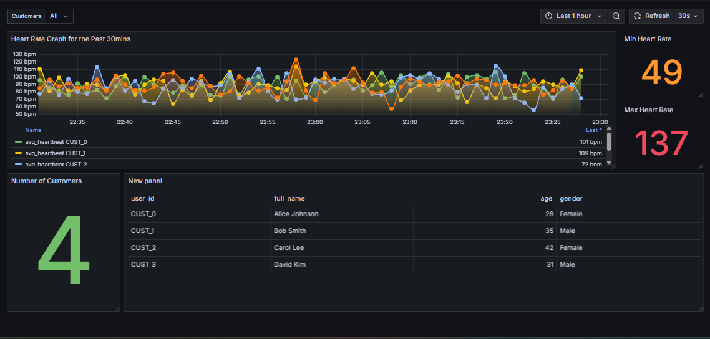

# Real-Time Heart Rate Monitoring System

This project simulates real-time heart rate data ingestion, processing, storage, and visualization using a modern big data pipeline built with Dockerized services.

## **Project Overview**

- **Simulator**: Python script simulates heart rate sensor data and streams it to Kafka.
- **Kafka**: Ingests the streaming heart rate data.
- **PySpark**: Reads from Kafka, processes, and aggregates heart rate data, writes results into PostgreSQL.
- **PostgreSQL**: Stores the aggregated heart rate metrics.
- **Grafana**: Visualizes aggregated heart rate metrics from PostgreSQL.
- **Docker Compose**: Orchestrates all services in isolated containers.


## **System Architecture**


1. **Clone the repository**  
```bash
git clone https://github.com/GEssuman/data-engineering-labs.git
cd data-engineering-labs
```

2. **Switch to the correct branch** 
```bash
git checkout spark/real-time-data-ingestion
```


3. **Environment Setup**
Create `.env` File


   To configure environment variables for your services, create a `.env` file in your project directory and populate it with the appropriate values from the `.env.example` file. This will configure your local environment for connecting to the various services like Kafka, Spark, and PostgreSQL.
---


4. **Start all services**  
```bash
docker compose up --build
```

## **Docker Compose Services**

- **PostgreSQL**: `postgres:14`
- **Kafka (Confluent)**: `cp-kafka:7.9.0`
- **PySpark (with Kafka integration)**: Custom Docker image
- **Grafana**: `grafana-oss:latest`
- **Heart Rate Simulator**: Custom Python Docker image (with `kafka-python`)

---


## 5. Grafana for Visualization

### 5.1. Access Grafana

Grafana is running on port 3000. To access the Grafana dashboard:

1. Open a web browser.
2. Navigate to: [http://localhost:3000](http://localhost:3000)
3. Log in using the default username `admin` and password `admin` (or the credentials you set in the environment variables).

### 5.2. Set Up the Heart Rate Dashboard

Once logged in:

1. Select the **Heart Rate Dashboard** to view the visualized heart rate data.

Sample visualization images are shown below:

 HeatBeat Time Series For One User
 

---
HeatBeat Time Series For All Users


---

---

