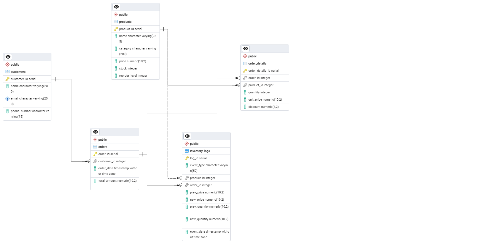

## Inventory & Order Management System

This project demonstrates an inventory and order management system using **PostgreSQL**. It includes the creation of key tables such as `customers`, `products`, `orders`, `order_details`, and `inventory_log`. 

### Key Features:
- **Stored procedures** to handle order processing as a transaction block
- **Triggers** to maintain data integrity and automate updates
- **Views** for simplified data analysis and reporting
- **Inventory logging** to track product changes and monitor order status

An **ERD (Entity Relationship Diagram)** is also provided below to illustrate the database structure and relationships.

