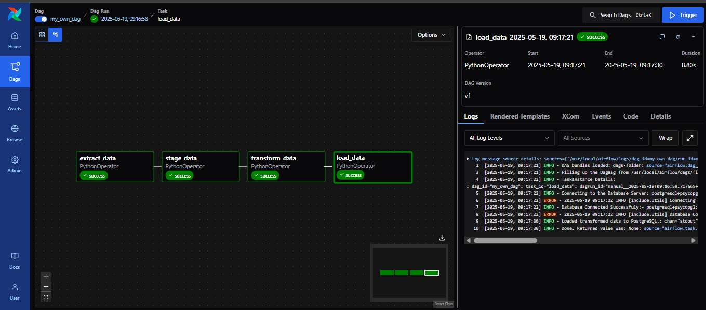

# Real-Time Heart Rate Monitoring System

Developing an End-to-End Data Pipeline for Flight Price Analysis in Bangladesh

## **Project Objective**
To build a reliable and automated data pipeline using Apache Airflow that processes flight price data for Bangladesh from ingestion to analysis. The pipeline is designed to:

- Ingest raw flight pricing CSV data.

- Validate and Stage the data to MySQL.

- Transform the data into a suitable structure.

- Compute key performance indicators (KPIs).

- Store the final output in a PostgreSQL database for downstream analysis and visualization.


## **Tools & Technologies Used**
| Tool           | Purpose                                  |
|----------------|-------------------------------------------|
| **Apache Airflow (Astro)** | DAG scheduling and orchestration     |
| **Pandas**      | Data transformation, cleaning, and KPI calculation |
| **MySQL**       | Intermediate staging of raw flight data  |
| **PostgreSQL**  | Final analytics data storage             |
| **Docker**      | Containerized service management         |
| **Python**      | Custom ETL logic                         |
| **Logging**     | Monitoring pipeline success and failure  |

##  Pipeline Status

- Data extraction from Kaggle using API  
- Data validation, cleanup, and schema normalization  
- Staging to MySQL  
- Data transformation with KPI and seasonality classification  
- Loading to PostgreSQL  
- Error handling & logging in each stage

## **User Guide**

1. **Clone the repository**  
```bash
git clone https://github.com/GEssuman/data-engineering-labs.git
cd data-engineering-labs
```

2. **Switch to the correct branch** 
```bash
git checkout airflow/flight-price-analysis
cd airflow
```


3. **Environment Setup**
Create `.env` File

   To configure environment variables for your services, create a `.env` file in your project directory and populate it with the appropriate values from the `.env.example` file. This will configure your local environment for connecting to the various services like MySql,and PostgreSQL.
---


4. **Start all services**  
```bash
astro dev start
```

## **Docker Compose Services**

This launches:
- Airflow apiserver
- Airflow Dag Processor
- Airflow Scheduler, Triggerer
- MySQL and PostgreSQL services

| Service     | Image             | Role                  |
|-------------|------------------|-----------------------|
| `mysql`     | `mysql:latest`   | Data staging          |
| `postgres`  | `postgres:14`    | Final storage         |
| `airflow`   | Astro-managed    | DAG orchestration     |

 Ensure all services are on the **same Docker network** (Astro handles this by default under `astro dev`).

---


## *Pipeline Overview**
1. Data Ingestion
Raw CSV files containing flight data are extracted form kaggle.

Files are parsed using pandas and read into memory preparing for staging.


2. Data Validation & Satagin
Columns are renamed and standardized to match database schema requirements

Datatypes such as datetime, float, and int are validated and converted appropriately.

Data is staged into a MySQL database.
---

3. KPI Computation
***---***

4. Database Storage
Final cleaned and enriched dataset is written to a PostgreSQL database.

Schema includes fields like airline, source, destination, fare, departure time, etc.


## After Succesful Run on the DAG in the api-webser

***DAG in Graph Form***



***DAG in Grid Form***
